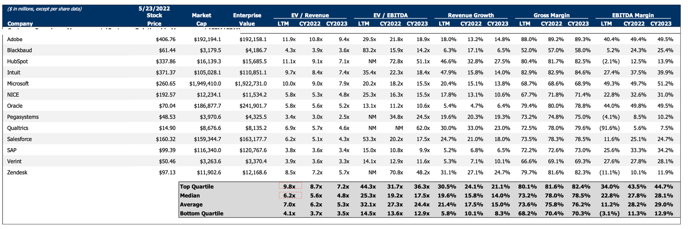
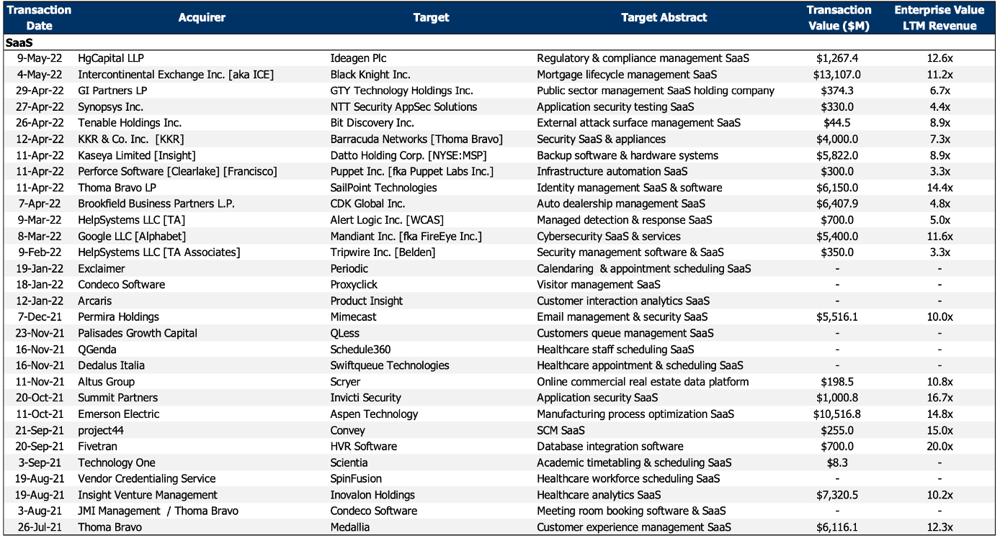
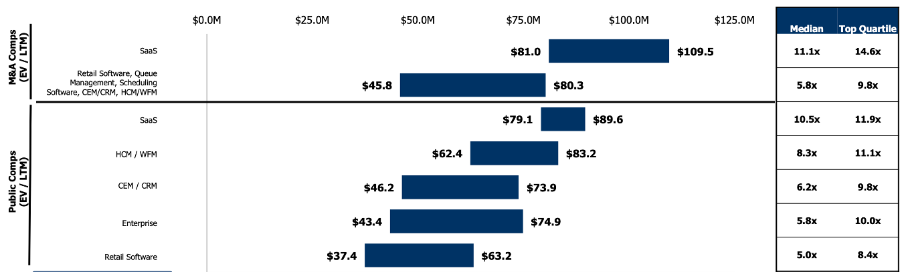

<section class="title-slide">
Semana 3 | Valoración de empresas: principios y metodologías

Mercados y Riesgos Financieros • <em>Octubre 22, 2025</em>

</section>

---

## Agenda
1. Sobre la Semana Anterior
2. Contenido Semana 3
4. Discusión del Caso: "CREDIDEMO"

---

## Sobre la Semana Anterior
- 2.1 Teoría del valor presente y tasa de descuento
- 2.2 Modelo de valoración de activos financieros (CAPM)
- 2.3 Teoría moderna de portafolio (Markowitz)
- 2.4 Mercado de capitales eficiente
- 2.5 Instrumentos del mercado de capitales
    - 2.5.1 Clasificación de instrumentos del mercado de capitales.

---

## Semana 3
Valoración de empresas: principios y metodologías

---

**Semana 3: Valoración de empresas: principios y metodologías**
- 3.1 Metodologías de análisis financiero
    - 3.1.1 Análisis vertical y horizontal
    - 3.1.2 Análisis de razones financieras 
    - 3.1.3 Solvencia financiera

--

- 3.2 Metodologías de valoración de empresas
    - 3.2.1 DCF
    - 3.2.2 Múltiplos
    - 3.2.3 Patrimoniales
- 3.3 CREDIDEMO

---

## 3.1 Metodologías de análisis financiero — Principios
- Propósito: evaluar salud, riesgos y **capacidad de generar valor**.
- Fuentes: **Balance**, **Estado de Resultados**, **Flujos**.
- Comparar con: **historia**, **sector/pares**, **coyuntura**.
- El contexto macro importa: inflación, **tasas**, FX, ciclo, liquidez.

--

## 3.1.1 Análisis vertical (composición)
- % de cada rubro sobre un **total**.
  - ER: % sobre **Ventas** (márgenes).
  - Balance: % sobre **Activos totales** (estructura).
- Uso: comparabilidad inter-empresa y cambios de **mix**.

--

- Notas operativas:
  - Estabiliza diferencias de **tamaño**; útil en series propias.
  - Revisar criterios contables (**IFRS/US GAAP**).

--

## 3.1.2 Análisis horizontal (tendencias)
- Crecimientos y aceleraciones en series **3–5 años**.
- Fórmula: **%Δ Xₜ = (Xₜ − Xₜ₋₁) / Xₜ₋₁ × 100%**.
- Mirar: ventas, márgenes, apalancamiento, cobertura, capex.
- Ajustar por **inflación** cuando aplique (consistencia temporal).

--

## 3.1.2.1 Horizontal — señales de alerta
- Pasivos crecen **> activos** de forma persistente.
- Margen y rotaciones **deteriorándose**.
- **Capex < depreciación** por periodos largos.

--

## 3.1.3 Razones financieras — panorama
- Objetivo: convertir datos contables en **indicadores comparables**.
- Grupos: **liquidez**, **eficiencia**, **rentabilidad**, **mercado**.
- Interpretación **relativa** (sector, historia, pares).

--

## 3.1.3.1 Liquidez
- **Razón corriente** = AC / PC (>\~1 según industria).
- **Prueba ácida** = (AC − Inventarios) / PC.
- **CCC** = Días Inv + Días CxC − Días CxP (eficiencia de caja).

--

## 3.1.3.2 Eficiencia / actividad
- **Rotación de activos** = Ventas / Activos totales.
- **Rotación de inventarios** = Costo ventas / Inventario prom.
- **Días CxC** = CxC / Ventas diarias; **Días CxP** = CxP / Compras diarias.
- Meta: mayor **productividad** del capital operativo.

--

## 3.1.3.3 Rentabilidad
- **Margen neto** = Utilidad Neta / Ventas.
- **ROA** = Utilidad Neta / Activos; **ROE** = Utilidad Neta / Patrimonio.
- **DuPont (3 pasos)**: ROE = Margen × Rotación × Apalancamiento.
- Insight: ROE alto puede venir de **apalancamiento** (riesgo).

--

## 3.1.3.4 Mercado (si cotiza)
- **P/E** = Precio / EPS; **P/B** = Precio / Valor libro por acción.
- **EV/EBITDA** = (Cap. bursátil + Deuda neta) / EBITDA.
- Uso: expectativas del mercado y **valor relativo**.

--

## 3.1.4 Solvencia financiera
- **Deuda/Activos**, **Deuda/Patrimonio**, **D/(D+E)**.
- **Cobertura de intereses (ICR)** = EBIT / Intereses.
- **Capital de trabajo neto** = AC − PC (puente liquidez–solvencia).
- Solvencia sólida ⇒ mejor **acceso/costo** de financiamiento.

--

## 3.1.4.1 Calificación y prima de riesgo
- Tasa exigida = $r_f$ + **spread** de crédito.
- Drivers: **rating**, plazo, liquidez, volatilidad sector/país, macro.
- Escala típica: **AAA–A** (bajo) … **B/CCC** (alto) … **D** (default).
- Mejor rating ↓ spread ⇒ ↓ **k_d** (después de impuestos) ⇒ ↓ **WACC**.

---

## 3.2 Metodologías de valoración — Mapa
- Familias:
  1) **Ingresos (DCF/APV)**: FCFF/FCFE → VP de flujos.
  2) **Mercado (relativos)**: múltiplos y transacciones comparables.
  3) **Patrimoniales**: VCA, liquidación, valor sustancial.

--

- Triangulación: usar **más de un método**; **no** promediar mecánicamente.

--

## 3.2.1 DCF — elección FCFF vs FCFE
- **FCFF** descontado a **WACC** ⇒ **Enterprise Value (EV)**.
- **FCFE** descontado a **k_e** ⇒ **Equity Value**.
- Elegir según objetivo: **firma (EV)** vs **equity** y estabilidad del apalancamiento.
- Ajustes: **no operativos** y **deuda neta** para pasar de EV a equity.

--

## 3.2.1.1 Costo de capital y valor terminal
- **WACC** $= (E/(D+E))·k_e + (D/(D+E))·k_d·(1−T)$
- **CAPM**: $k_e=r_f+/beta /times EMRP$ (β (des)apalancar a estructura objetivo).
- **TV** explica gran parte del valor; **g** ≤ crecimiento de largo plazo sector/economía.
- Consistencia operativa: **g ≈ ROIC × tasa de reinversión**.

--

## 3.2.1.2 Variantes: APV y Capital Cash Flow
- **APV**: VP flujos (a **$k_u$**) + VP **escudos** − **costos de distress**.
- Útil si el **apalancamiento cambia** materialmente en el tiempo.
- **Capital Cash Flow (CCF)**: FCFF + escudos, descontado a **k_u**.

--

## 3.2.2 Múltiplos — selección y limpieza
- **Enterprise**: EV/EBITDA, EV/EBIT, EV/Ventas.
- **Equity**: P/E, P/B, P/CF.
- Comparables: alinear **crecimiento, rentabilidad, riesgo, contabilidad, liquidez**.
- Limpiar **one-offs**, criterios contables y **normalizar** métricas.

--

## 3.2.2 Múltiplos - Un ejemplo práctico (1/3)

--

## 3.2.2 Múltiplos - Un ejemplo práctico (2/3)

--

## 3.2.2 Múltiplos - Un ejemplo práctico (3/3)

--

## 3.2.2.1. Consistencias Enterprise vs Equity
- **EV ↔ métricas pre-deuda** (EBITDA/EBIT).
- **Equity ↔ métricas post-deuda** (EPS, BVPS, FCFE).
- Ajustes: **arrendamientos**, **minoritarios**, **caja/exceso**, **pensiones**.
- Uso: anclar **rango** de valor y negociación (evitar promedio ingenuo).

--

## 3.2.3. Patrimoniales (con sensibilidades)
- **Valor contable ajustado**: activos/pasivos a **mercado**.
- **Liquidación**: valor neto en **cierre ordenado**.
- **Sustancial**: activos netos reales (reposición/uso económico) − pasivo exigible.

--

- Útiles en negocios **asset-heavy** o con flujos **difusos**.
- Sensibilizar: **márgenes, capex, WACC, g, β, estructura**; usar **rangos**.

---

## CREDIDEMO

---

## Dudas y Preguntas